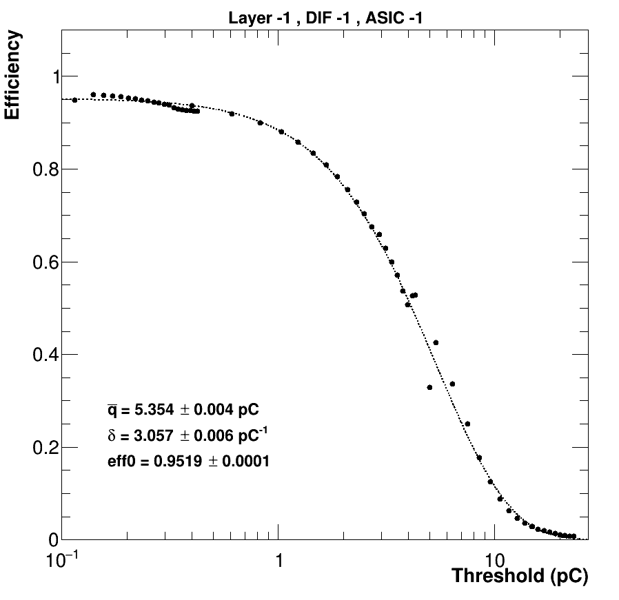
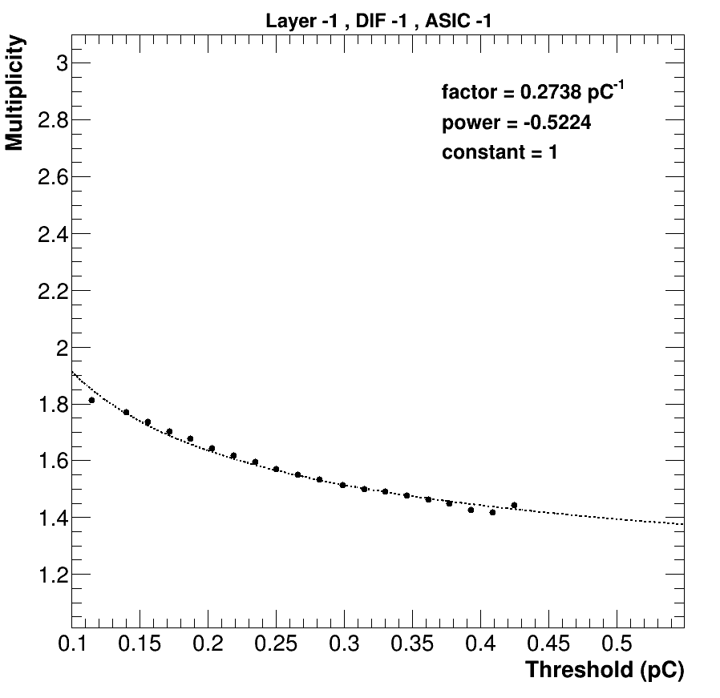
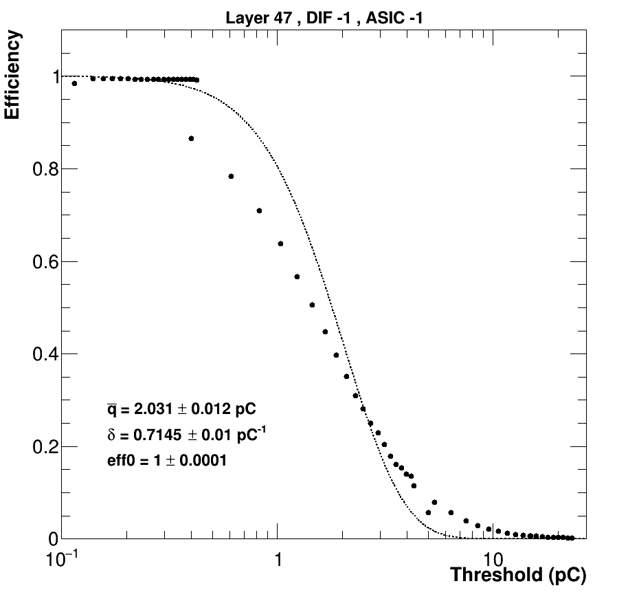
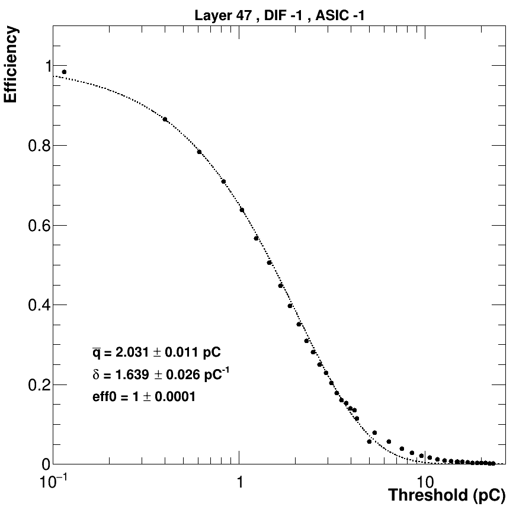

# Digitization and uniformed states : How to

### Requirements :

* Softwares :
    * [iLCSoft](https://github.com/iLCSoft/iLCInstall)
    * [SDHCALSim](https://github.com/SDHCAL/SDHCALSim)
    * [SDHCALMarlinProcessor](https://github.com/ggarillot/SDHCALMarlinProcessor) which needs [CaloSoftWare](https://github.com/ggarillot/CaloSoftWare)
    * [PolyaFit](https://github.com/ggarillot/PolyaFit)
    * [MarlinReco](https://github.com/iLCSoft/MarlinReco) - automatically installed with iLCSoft

* Perform a complete muon scan

In my case I used the muon scan performed in October 2015, here are the list of runs :

|  Run   | DAC0 | DAC1 | DAC2 |
|:------:|:----:|:----:|:----:|
| 730630 | 188  | 130  | 168  | 
| 730627 | 199  | 147  | 185  | 
| 730626 | 210  | 164  | 202  | 
| 730625 | 221  | 181  | 220  | 
| 730619 | 232  | 197  | 237  | 
| 730618 | 243  | 214  | 254  | 
| 730617 | 254  | 231  | 271  | 
| 730616 | 265  | 248  | 288  | 
| 730615 | 276  | 265  | 305  | 
| 730611 | 287  | 282  | 323  | 
| 730609 | 299  | 298  | 340  | 
| 730607 | 310  | 315  | 357  | 
| 730569 | 321  | 332  | 374  | 
| 730568 | 332  | 349  | 391  | 
| 730567 | 343  | 366  | 408  | 
| 730566 | 354  | 383  | 425  | 
| 730631 | 365  | 399  | 443  | 
| 730633 | 376  | 416  | 460  | 
| 730545 | 387  | 433  | 477  | 
| 730677 | 170  | 498  | 342  | 

(The 730677 run is a 80GeV pion run but it still has a lot of muons)

### Objectives :

* Create an uniformed state for the SDHCAL (uniformed multiplicities and efficiencies)
* Reproduce the non-uniformities in the digitization process

---

## Create an uniformized state for the SDHCAL

### Procedure : 

1. Perform a muon scan
    * As the conditions / configurations / RPCs degradation changes between different beam tests you will have to perform a new muon scan for each test beam if you plan to create an unifomized state
2. Compute the efficiencies / multiplicities for all the runs of the muon scan
3. Adjust the efficiencies versus threshold and multiplicities versus threshold with analytical formulas
4. Create a new database state by asking a certain value of multiplicity and efficiency of 2nd and 3rd thresholds

### Compute the efficiencies / multiplicies for a given run :

Create a `.json` file which describes the configuration of the SDHCAL (DIFs location). You can find existing `.json` files for previous configurations in the `SDHCALMarlinProcessor/DifGeom` folder.

Modify the `dataEfficiency.py` file according to your installation, location of data files and geometry (lines 3, 23, 38, 48 and 55)

Run the `dataEfficiency.py` script for the given run number (example run 730677): 

    chmod +x dataEfficiency
    ./dataEfficiency.py 730677

This produces a `.root` file with a big `TTree` which contains the computed efficiencies and multiplicities (and associated errors) for the three thresholds and for all the layers / DIFs / ASICs / pads.

Example : if you want to access the efficiency for the pad 41 of the ASIC 8 of the DIF 112 : 

    root [] tree->Scan("Efficiencies[0]:Ntrack","DifID==112 && AsicID==8 && PadID==41")
    ************************************
    *    Row   * Efficienc *    Ntrack *
    ************************************
    *   409259 *    0.9375 *        16 *
    ************************************

`Efficiencies[0]` means the efficiencies for the first threshold, you can access second and third thresholds with `Efficiencies[1]` and `Efficiencies[2]` respectively.
`Ntrack` is the statistics (here the efficiency is computed using 16 tracks)

If you want to access the efficiency for the whole ASIC instead you have to put "`PadID==-1`": 

    root [] tree->Scan("Efficiencies[0]:Ntrack","DifID==112 && AsicID==8 && PadID==-1")
    ************************************
    *    Row   * Efficienc *    Ntrack *
    ************************************
    *   409282 * 0.9709702 *      1309 *
    ************************************

Example : Multiplicity for a whole layer : 

    root [] tree->Scan("Multiplicities[0]:Ntrack","LayerID==7 && AsicID==-1")
    ************************************
    *    Row   * Multiplic *    Ntrack *
    ************************************
    *    74887 * 1.5534775 *    178851 *
    ************************************

Example : Efficiency of third threshold for the whole detector : 

    root [] tree->Scan("Efficiencies[2]:Ntrack","LayerID==-1")
    ************************************
    *    Row   * Efficienc *    Ntrack *
    ************************************
    *   458689 * 0.0284023 *   8328716 *
    ************************************

### Adjust the efficiencies and multiplicies versus the threshold :

Once you ran `dataEfficiency.py` for all the runs you have to use the `PolyaFit` package to adjust the efficiencies and multiplicities. You will have the pleasure to notice that this package does not contains any form of documentation nor readable code. 

Basically there

To install : 

    git clone https://github.com/ggarillot/PolyaFit
    cd PolyaFit
    mkdir build ; cd build
    cmake -C $ILCSOFT/ILCSOFT.cmake
    make -j8 install

You have to create a `.json` file which contains the list of the runs from the scan and their corresponding thresholds - in DAC values. You can find examples in the `PolyaFit/json` folder.

To draw the efficiency / multiplicity versus threshold for all the ASICs and layers you can run this (example in my case): 

    ./bin/drawData json/SPS_Oct2015.json

The program looks like it is stuck and will never finish at some point (at the "`Write canvas`" step, but it is not the case (I never found out why). When it is finished you have a big file named `drawData.root` full of curves like this : 

    
    

If you study the October 2015 runs you will notice that the fits for the layer 47 fails because of the weird behaviour of the electronics : 

    

So in this case you can uncomment the lines 313/314 of the `PolyaFit/src/GraphManager.cpp` : 

    //			if ( i != mulRef && layerID == 47 )
    //				c = 1 ;

in order to have good fits : 

    

If you only want to compute the fit parameters you have to run this (example in my case : )

    ./bin/fit json/SPS_Oct2015.json

This outputs a file named `resData.root` containing only the fit parameters in a `TTree`

### Create a new database state :

To create a new database state you have to use the `bin/findThr` program and choose a target multiplicity and target efficiencies of second and third threshold.

Example : if you want to create a state with a target multiplicity of `1.7`, a second threshold efficiency of `80%` and a third threshold efficiency of `2.5%` : 

    ./bin/findThr resData.root 1.7 0.8 0.025

This outputs two files : `targetThr.root` and `changeThr.py`. 

The `targetThr.root` file contains the thresholds (in pC and DAC values) of this new state. 

The `changeThr.py` is the python script to launch to upload the new state on the database. You have to change the reference state at the line 2.

